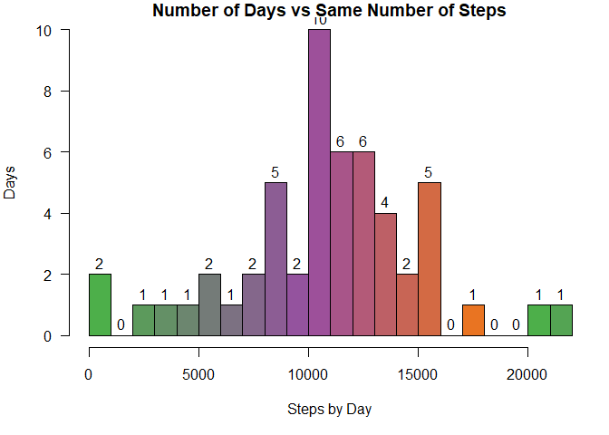
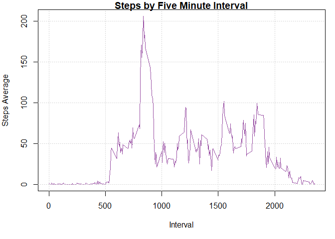
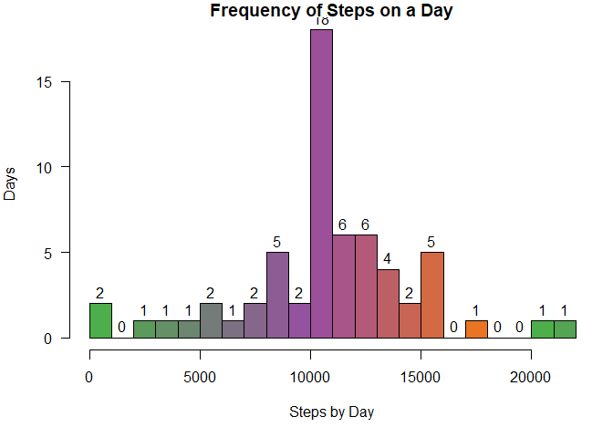
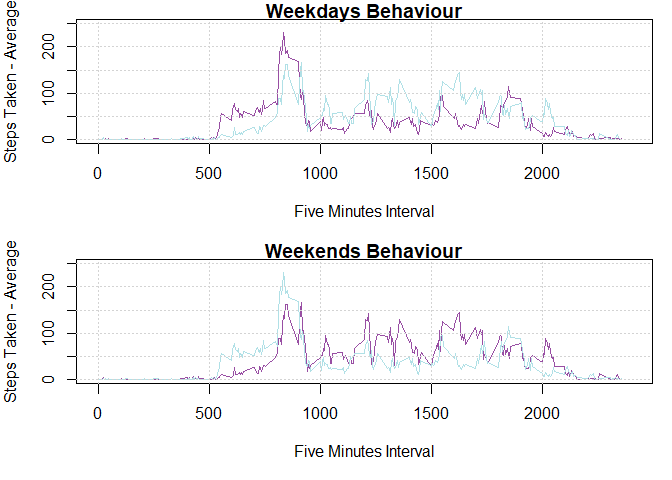

## Libraries

##### My libraries to work today: (Uncomment if you don't have them installed)


```r
#install.packages("dplyr")
#install.packages("tidyr")
#install.packages("RColorBrewer")
#install.packages("chron")
library(dplyr)
```

```
## 
## Attaching package: 'dplyr'
```

```
## The following objects are masked from 'package:stats':
## 
##     filter, lag
```

```
## The following objects are masked from 'package:base':
## 
##     intersect, setdiff, setequal, union
```

```r
library(tidyr)
library(RColorBrewer)
library(chron)
```

```
## NOTE: The default cutoff when expanding a 2-digit year
## to a 4-digit year will change from 30 to 69 by Aug 2020
## (as for Date and POSIXct in base R.)
```

## Decompressing the file


```r
unzip(zipfile="repdata_data_activity.zip") 
```


## Color Palette


```r
cols<-brewer.pal(5,"Set1")
pal<-colorRampPalette(colors = cols[3:5])
palette(pal(7))
ColorDays<-pal(7)
```

## Reading the data


```r
data4work<-read.csv(file="activity.csv",na.strings = "NA")
print(head(data4work,n=5))
```

```
##   steps       date interval
## 1    NA 2012-10-01        0
## 2    NA 2012-10-01        5
## 3    NA 2012-10-01       10
## 4    NA 2012-10-01       15
## 5    NA 2012-10-01       20
```

## 1) Counting the Steps in each Day

Steps by day:

```r
data4work<-mutate(data4work,date=factor(data4work$date))
StepsByDay<-tapply(data4work$steps,data4work$date,sum)
StepsDayData<-data.frame(StepsByDay,Days=factor(unique(data4work$date)))
rm(StepsByDay)
```

### Histogram for the StepsDayData:


```r
par(mar=c(5,4,1,1), las=1,mfrow=c(1,1))
with(data = StepsDayData,hist(StepsByDay,breaks = 20,col=pal(20),
                              xlab = "Steps by Day", ylab = "Days", 
                              main = "Number of Days vs Same Number of Steps",
                              labels = TRUE))
```

<!-- -->


### Mean and Median of the Numbre of Steps by Day


```r
StepsByDaySummary<-summary(StepsDayData$StepsByDay)
print(StepsByDaySummary)
```

```
##    Min. 1st Qu.  Median    Mean 3rd Qu.    Max.    NA's 
##      41    8841   10765   10766   13294   21194       8
```

### The mean is 1.0766189\times 10^{4} anf the median is 1.0765\times 10^{4}

#### In this part the NA's were isolated to specific days, so it could be worked arround and plotted arround. However, in the next one the daily behaviour will be evaluated, so the NA's must be removed to be able to get the averages or even the total without losing data (all of the data becomes NAs if they're not removed).

## 2) Daily Activity Pattern

### Before removing the NAs:


```r
data4work<-mutate(data4work,interval=factor(data4work$interval))
StepsByIntervalMean<-tapply(data4work$steps,data4work$interval,mean)
StepsIntervalData<-data.frame(StepsByIntervalMean,
                              Interval=factor(unique(data4work$interval)))
rm(StepsByIntervalMean)
head(StepsIntervalData)
```

```
##    StepsByIntervalMean Interval
## 0                   NA        0
## 5                   NA        5
## 10                  NA       10
## 15                  NA       15
## 20                  NA       20
## 25                  NA       25
```

### After removing the NAs:


```r
data4work<-mutate(data4work,interval=factor(data4work$interval))
data2work<-subset(data4work,!is.na(data4work[,1]))
StepsByIntervalMean<-tapply(data2work$steps,data2work$interval,mean)
StepsIntervalData<-data.frame(StepsByIntervalMean,
                              Interval=factor(unique(data4work$interval)))
rm(list=c("StepsByIntervalMean","data2work"))
head(StepsIntervalData)
```

```
##    StepsByIntervalMean Interval
## 0            1.7169811        0
## 5            0.3396226        5
## 10           0.1320755       10
## 15           0.1509434       15
## 20           0.0754717       20
## 25           2.0943396       25
```

### Plotting the Daily behaviour:


```r
par(mar=c(5,4,1,1),mfrow=c(1,1))
plot(levels(StepsIntervalData$Interval),StepsIntervalData$StepsByIntervalMean,
                             main = "Steps by Five Minute Interval", 
                             xlab = "Interval",ylab = "Steps Average",
                             col=ColorDays[4], type = "l")

grid(col = "lightgray", lty = "dotted", lwd = 1, equilogs = TRUE)
```

<!-- -->

(Image 2)


```r
MaxStepsin5<-StepsIntervalData[StepsIntervalData$StepsByIntervalMean==max(StepsIntervalData$StepsByIntervalMean),]
```


### The maximum average steps/five minutes were 206.1698113 in the interval 835

## 3) Imputing Missing Values


### Substituting missing values with the daily behavioural mean


```r
missingDays<-unique(data4work$date[is.na(data4work$steps)])
data2work<-data4work
MeanSteps<-StepsIntervalData$StepsByIntervalMean
data2work$steps[data2work$date%in%missingDays]<-MeanSteps
rm(list=c("missingDays","MeanSteps"))
```

### Now the histogram (Image 1) must be repeated with the new data:


```r
par(mar=c(5,4,1,1), las=1, mfrow=c(1,1))
with(data = StepsDayData2,hist(StepsByDay,breaks = 20,col=pal(20),
                              xlab = "Steps by Day", ylab = "Days", 
                              main = "Frequency of Steps on a Day",
                              labels = TRUE))
```

<!-- -->

(Image 3)

### The number of days with the mean Steps/Day has gone from 10 to 18 since the first histogram (Image 1)

### The first mean was 1.0766189\times 10^{4} anf the first median was 1.0765\times 10^{4}

### Now to calcule the new ones:


```r
StepsByDaySummaryImputed<-summary(StepsDayData2$StepsByDay)
print(StepsByDaySummaryImputed)
```

```
##    Min. 1st Qu.  Median    Mean 3rd Qu.    Max. 
##      41    9819   10766   10766   12811   21194
```

### The mean stays the same: 1.0766189\times 10^{4} and the new median will be 1.0766189\times 10^{4} higher than the old one, even if only by a step. The difference is of 1.0891/10765.1 , approximately 0.01%.

## 4) Comparisson between Weekday's and Weekend's Behaviours.


```r
WeekyDays<-strptime(data2work$date, format = "%Y-%m-%d")
IsWeek<-!is.weekend(WeekyDays)
WeekFactor<-as.character(IsWeek)
WeekFactor[IsWeek]<-"Weekday"
WeekFactor[!IsWeek]<-"Weekend"
WeekyLevels<-c("Weekday","Weekend")
WeekFactor<-factor(WeekFactor,levels = WeekyLevels)
data2work<-mutate(data2work,weekday_or_weekend=WeekFactor)
rm(list = c("WeekyDays","IsWeek","WeekFactor","WeekyLevels"))
head(data2work)
```

```
##       steps       date interval weekday_or_weekend
## 1 1.7169811 2012-10-01        0            Weekday
## 2 0.3396226 2012-10-01        5            Weekday
## 3 0.1320755 2012-10-01       10            Weekday
## 4 0.1509434 2012-10-01       15            Weekday
## 5 0.0754717 2012-10-01       20            Weekday
## 6 2.0943396 2012-10-01       25            Weekday
```

### Now we create the groups to summarize


```r
data4Weekend<-subset(data2work,grepl("Weekend",data2work$weekday_or_weekend))
data4Weekdays<-subset(data2work,grepl("Weekday",data2work$weekday_or_weekend))
StepsByIntervalWeekends<-tapply(data4Weekend$steps,data4Weekend$interval,mean)
StepsByIntervalWeekdays<-tapply(data4Weekdays$steps,data4Weekdays$interval,mean)
Interval<-levels(data4Weekend$interval)
```

#### Now, with the data separated, the plot for the Weekdays and Weekends can be compared. The powderblue line is the contrasting behaviour, the purple line is the bevaviour that's been plotted.


```r
par(mfrow=c(2,1), mar=c(5,4,1,1))
plot(Interval,StepsByIntervalWeekdays,type="l", main="Weekdays Behaviour",
     xlab= "Five Minutes Interval", ylab="Steps Taken - Average",
     col=ColorDays[4], xlim = c(0,2400), ylim=c(0,250))
lines(Interval,StepsByIntervalWeekends,col="powderblue")
grid(col = "lightgray", lty = "dotted", lwd = 1, equilogs = TRUE)
plot(Interval,StepsByIntervalWeekends,type="l", main="Weekends Behaviour",
     xlab= "Five Minutes Interval", ylab="Steps Taken - Average",
     col=ColorDays[4],xlim = c(0,2400), ylim=c(0,250))
lines(Interval,StepsByIntervalWeekdays,col="powderblue")
grid(col = "lightgray", lty = "dotted", lwd = 1, equilogs = TRUE)
```

<!-- -->

(Image 4)


### The weekdays have a peak of activity between 8:00am to 10:00am, while the weekedns have a wider range of activity (three blocks, the first: 8:00am to 10:00am aprox., the second one: from 1:00pm to 2:30 aprox., and the last one: from 3:30pm maybe 4:00pm to something close to 6:00pm), but lower than the peak for the weekdays.
